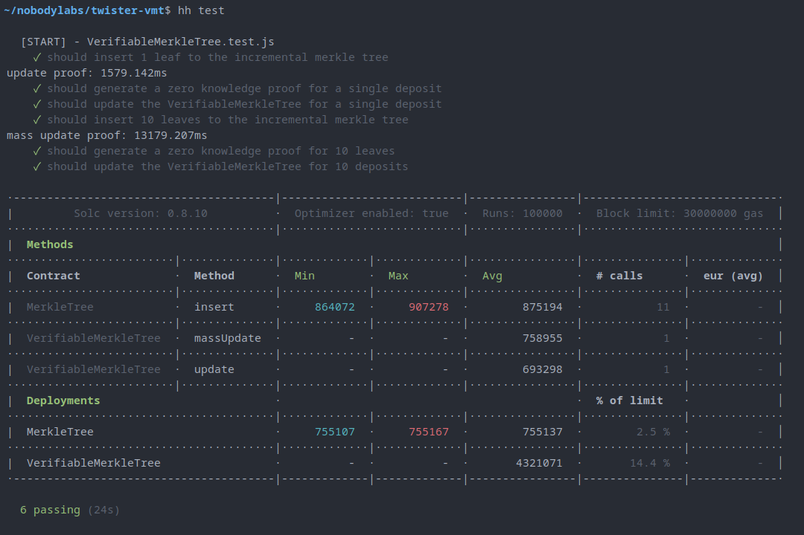

# Verifiable Merkle Tree
The Verifiable Merkle Tree (VMT) is a new kind of SNARK data structure that is powered by Computational Integrity Proofs (CIPS). The VMT is useful for maintaining an up-to-date merkle tree of commitments on an EVM based blockchain, e.g. Ethereum, which is so popular that demand for blockspace causes gas prices to be high at times. VMT helps reduce costs to individual users, lowering the cost barrier for use-cases like on-chain privacy.

# Computational Integrity Proofs
CIPs are zero knowledge proofs without any secret parameters--all inputs are public. We're not seeking privacy with this structure, just verifiability. SNARKs enable succinct verification of computations, in this case, we compute the next state of a merkle tree given a list of leaves, then we submit that for verification in an EVM based smart contract where the resulting state is stored.

# Tradeoffs
One of the tradeoffs of this design is that we require off-chain computations to construct the SNARK proof, meaning a third party periodically pays gas to advance the tree. However, token anonymizers already require a relayer to submit withdrawals, therefore this doesn't add any additional infrastructure that doesn't already need to exist. Another tradeoff is that a committer cannot submit a merkle proof of inclusion within the tree until the batch is updated on-chain, so there is a mandatory period of waiting time before the tree is useful to the committer. In a token anonymizer, however, it is desirable for a depositor to wait for more deposits, because it gives them greater anonymity guarantees if there are more deposits in the anonymity set.

# Contracts

## VerifiableMerkleTree.sol
This contract implements the Verifiable Merkle Tree. It has two methods for updates:
 1. `update`
    - inserts a single leaf using a zk proof
 2. `massUpdate`
    - inserts 10 leaves using a zk proof

## MerkleTree.sol
This contract implements the incremental merkle tree. Its state is updated one-at-a-time and it's included in this repo to show that the VMT matches the state of this tree after both kinds of updates.

## ProofLib.sol
Contains a modified version of the pairing library that's auto-generated from snarkjs.

## UpdateVerifier.sol and MassUpdateVerifier.sol
Contains optimized versions of the snarkjs auto-generated verifiers. Every time you build the circuits, these contracts are updated.

# Dependencies
 - node v12.22.2
 - make
 - python3

# Install
```sh
$ git clone https://github.com/Nobody-Labs/twister-vmt
$ cd twister-vmt
$ yarn
```
Alternatively, instead of `yarn`, you can use `npm install`.

# Build
We have to build the circuits, because git lfs doesn't play well over ssh. We only have to build the circuits once, which includes a step where we have to download a ~0.5GiB file. The file is `powersOfTau28_hez_final_19.ptau`, and it's used to setup the [mass_deposit](./circuits/mass_update.circom) circuit.

There's two ways you can build the circuits. You can use the Makefile.
```sh
$ make all
```

You can build them individually by running the following bash scripts:
```sh
$ ./scripts/build_update.sh
```

```sh
$ ./scripts/build_mass_update.sh
```

If the scripts fail, try setting their permissions to executable.
```sh
$ sudo chmod 755 ./scripts/build_update.sh
$ sudo chmod 755 ./scripts/build_mass_update.sh
```
The mass_update build will take a while, because it has to retrieve the powers of tau file, and the keys are much larger. If we migrate to poseidon, then this circuit should shrink considerably.

Each build script will compile the circuit, generate proving and verifying keys, export a solidity contract, and then insert the freshly built verifying key into the optimized verifier contracts in [verifiers](./contracts/verifiers/). You can see the templates for the optimized verifier contracts in [verifier_templates](./circuits/verifier_templates/).

# Run the Test
After we've built everything, now it's time to test it.
```sh
$ npx hardhat test
```
*jeopardy music plays*


There's a way faster testing environment: [foundry](https://getfoundry.sh/). I'm working on a foundry fork of this repository, so there's no need for you to steal my thunder! I could also improve the speed of this hardhat test suite by precomputing the proofs during the build step.

## Test Results


The most striking thing from VMT is that **updating batches of leaves is cheaper than manually computing even a single insertion** in the incremental merkle tree on-chain.